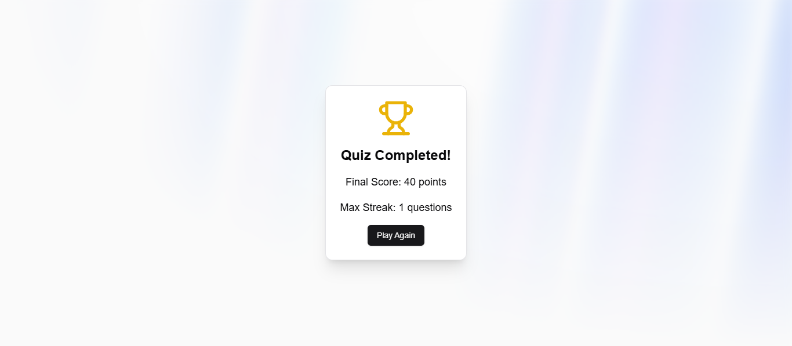

# Quiz App

Welcome to the Quiz App! 🎉 This web-based quiz application is designed to provide an engaging and interactive quiz experience. The app features gamification elements, a timer, and a scoring system to keep you on your toes. Test your knowledge, beat your high score, and enjoy the challenge!

## 🚀 Demo

Check out the live version of the quiz app:  
[Quiz App - Live Demo](https://quiz-app-lakshitaa.netlify.app/)

## 🎮 Features

- **Gamified Experience:** Earn points for each correct answer and try to keep your streak going.
- **Timer:** Race against the clock as you answer questions.
- **Streaks:** Keep a streak of correct answers for extra points!
- **Results Summary:** View your final score and max streak once the quiz is complete.
- **User-Friendly Interface:** An intuitive and easy-to-navigate design that lets you focus on the quiz itself.

## 📸 Screenshots

Here are a few screenshots of the app in action:


*The app's welcoming start screen.*


*Answer questions and keep track of your score.*


*See your final score and streaks after completing the quiz.*

> **Note:** Replace the paths of the images with actual screenshot links or files you want to include.

## 🛠️ Technologies Used

- **ReactJS**: The front-end framework for building the UI.
- **Tailwind CSS**: For styling the app with a utility-first approach.
- **Lucide Icons**: Used for adding icons like trophy, timer, and stars.
- **Netlify**: Deployed on Netlify for easy hosting and continuous integration.

## 📝 Setup & Installation

To run the quiz app locally on your machine:

1. Clone this repository:
   ```bash
   git clone https://github.com/yourusername/quiz-app.git
   ```

2. Navigate to the project directory:
   ```bash
   cd quiz-app
   ```

3. Install the dependencies:
   ```bash
   npm install
   ```

4. Start the development server:
   ```bash
   npm run dev
   ```

5. Open your browser and go to `http://localhost:3000`.

## 🧑‍💻 Contributing

If you’d like to contribute to this project, feel free to fork the repository and submit pull requests. We appreciate your help in improving the app!

## 👨‍💻 License

This project is open-source and available under the [MIT License](LICENSE).

---

**Created with ❤️ by Lakshitaa Chellaramani**
